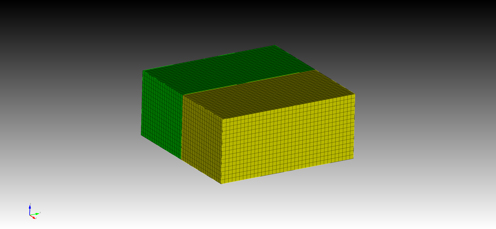

# CubitMesh
use python and script to generate cubit mesh

## Steps

>1. modify the path-to-cubit in src/setup.py @[line](https://github.com/shubiuh/CubitMesh/blob/57a6c9a6b429451325f5051115a20d5678bac5b5/src/setup.py#L5) 
`sys.path.append("C:\\Program Files\\Trelis 17.0\\bin")`
>2. change the Python version in cubit to 3
>3. use Python version 3.8 to `import cubit`

A [simple test](Src/test.py) generates two blocks and hex meshes. 
 

